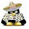

**RasberryPi Linux notes :::**

(general Linux erros can be resolved with the following)

#### sudo rm -r /var/lib/apt/lists/*
#### apt-get clean && sudo apt-get update
#### sudo apt-get autoclean
#### sudo apt-get -f install
#### sudo apt-get autoclean
#### sudo apt-get autoremove -y
#### sudo apt-get update -y
##### sudo apt-get update  - -fix-missing
##### sudo dpkg –configure -a
##### sudo apt-get install -f

######Cleaning installed Packages Downlaoded:
##### sudo apt autoclean
##### sudo apt clean

,